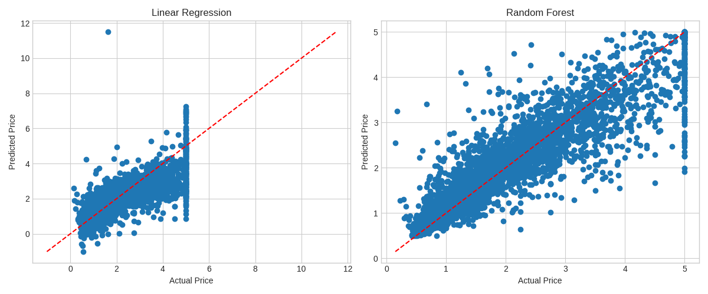

# House Price Prediction using Machine Learning

This project explores regression-based machine learning for predicting California housing prices using structured housing data.

The project compares:

* Linear Regression
* Random Forest Regressor

## Features

* Data preprocessing
* Correlation analysis
* Feature scaling
* Regression model training
* Model evaluation and comparison
* Feature importance visualization

## Technologies Used

* Python
* Pandas
* NumPy
* scikit-learn
* Matplotlib
* Seaborn

## Files

* `house-price-prediction-ml.ipynb` = main notebook
* `house-price-prediction-ml.py` - Python script version
* `plots/` - generated visualizations
* `requirements.txt` - required libraries

## Sample Visualization

## Learning Outcome

This project helped me understand:

* regression models
* train/test splitting
* feature scaling
* model evaluation metrics
* comparing ML models

## Note

If the notebook preview does not render on GitHub, the complete Python version of the project is available in `house-price-prediction-ml.py`.

